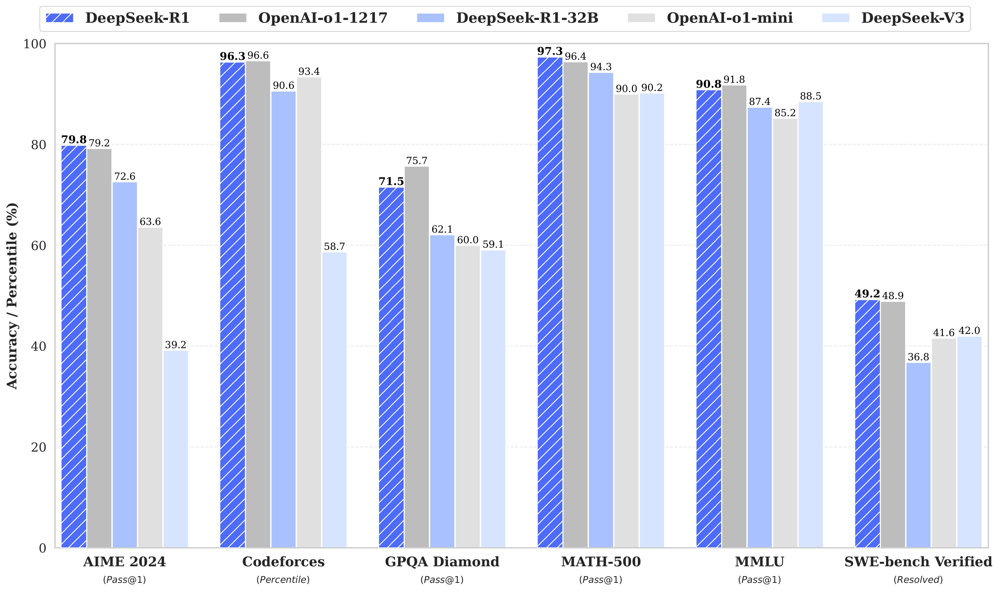
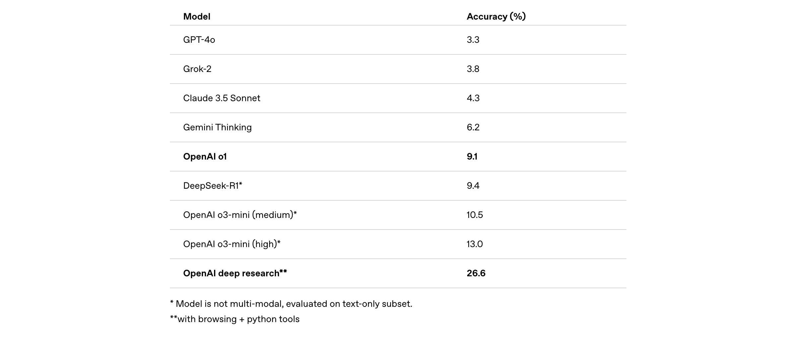

# AI 小白全扫盲

## 发展史


- 1950 艾伦·图灵发表《计算机器与智能》，提出"图灵测试"作为机器智能判定标准
- 1956 达特茅斯会议召开，约翰·麦卡锡等学者正式确立"人工智能"学科，Artificial intelligence 名词诞生；
- 1965 DENDRAL 专家系统问世；
- 1966 MIT 开发 ELIZA 聊天机器人；
- 1969 马文·明斯基出版《感知器》，揭示单层神经网络无法解决非线性问题；
- 1986 杰弗里·辛顿团队重新推广反向传播算法，为多层神经网络训练提供可行方案；
- 1997 IMB Deep blue 击败国际象棋世界冠军卡斯帕罗夫；为机器智能首次在智力游戏中击败人类；
- 2006 Deep Learning Geoffrey Hinton 深度学习神经网络；开启深度学习时代；
- 2012 Building High-level Features Using Large Scale 无监督学习 多层神经网络，识别 猫 图片；AlexNet 在 ImageNet 竞赛中夺冠，将识别错误率降低至 15.3;
- 2016 AlphaGo 战胜李世石；
- 2017 Google Brain Transformer Architecture 问世"Attention Is All You Need"；
- 2020 GPT-3 发布；
- 2022 ChatGPT 发布；
- 2024 Sora 视频生成模型发布；
- 2025 DeepSeek R1/V3 发布，实现训练成本和 token 价格大幅下降；
  <br>

## 基础技术概念扫盲

### AI 是什么？

**人工智能**（Artificial Intelligence）**实际上是一个很宽泛的概念， 是计算机科学的一个分支，旨在开发能够模拟人类智能行为的机器或软件系统。其核心目标是让机器具备**感知、学习、推理、决策**等能力。
所以我们耳熟能详的导航路线规划、智能家居、Siri、人脸识别 等也都能算作 AI。早期建立的专家系统（DENDRAL,非机器学习的产物）也属于 AI（它们在**低数据、高逻辑、强解释性的场景中表现良好）。
<br>

### 前些年很火的概念 机器学习和 AI 之间是什么关系？

**人工智能** **⊃** **机器学习**

简单说，人工智能是目的，机器学习是手段。我们最终要实现的人工智能，可以通过「机器学习」来实现。而当下机器学习的确又是实现人工智能的**重要 + 核心手段**。
从概念上说，机器学习是让计算机**从数据中自动学习规律**，并利用这些规律对新数据做出预测或决策的技术。它让机器像人类一样"通过经验改进表现"，而非依赖显式编程。
常见的机器学习范式有 监督学习，非监督学习，强化学习等。
<br>

### 深度学习呢？

**人工智能** **⊃** **机器学习** **⊃** **深度学习**

深度学习又是机器学习的一个子领域，专注使用**深层**神经网络来从数据中学习复杂模式。

| **维度**     | **传统**机器学习           | **深度学习**                      |
| ------------ | -------------------------- | --------------------------------- |
| **模型结构** | 浅层模型（1-3 层）         | 深层神经网络（≥5 层，甚至上千层） |
| **特征工程** | 依赖人工设计特征           | 自动学习特征表示                  |
| **数据需求** | 小数据即可训练（千级样本） | 需海量数据（百万级样本起）        |
| **计算资源** | CPU 可运行                 | 需 GPU/TPU 加速                   |
| **可解释性** | 较高（如决策树规则可视化） | 较低（黑箱模型）                  |
| **典型算法** | SVM、随机森林、XGBoost     | CNN、RNN、Transformer             |

除了深度学习，我们常见的机器学习方法还有例如监督学习中的 支持向量机(SVM)，决策树与改进算法，K 临近(KNN)，朴素贝叶斯等；无监督学习中的聚类算法，降维技术，关联规则挖掘等；强化学习中的 Q-learning, 策略梯度等。
<br>

### 经常听说的 transformer 和它们是什么关系？

**人工智能**（**AI**）⊃ **机器学习**（**ML**）⊃ **深度学习**（**DL**）⊃ **Transformer**架构

实际上 Transformer 是深度学习中的一种**神经网络**架构**，专门设计用于处理序列数据（如文本、语音、时间序列）。核心突破有 **自注意力机制** 和 **位置编码**。Transformer 架构自 2017 年提出以来，已成为人工智能领域的核心驱动力之一，为 AI 突破人类认知边界提供了全新范式（之前常用有卷积神经网络、循环神经网络等）。
**当前**++**所有**++**主流的 **LLM** **都基于** **transformer**。论文可以戳 👉🏻(https://arxiv.org/abs/1706.03762)。
<br>

### 耳熟能详的 Stable Diffusion 呢？

**扩散模型**（Diffusion）** 和 **Transformer** 是两种独立但可结合的 AI 模型架构。论文可以戳 👉🏻https://arxiv.org/abs/2112.10752
2022 年发布，主要专注于图片生成领域，在多模态领域应用较多。扩散模型原理通过 **"逐步加噪"再"逐步**去噪**"** 的方式生成数据（图像/音频等）。类比：将一张清晰的图片逐渐模糊成噪声（前向过程），再学习如何从噪声中恢复原图（反向过程）。可见 https://www.youtube.com/watch?v=oWO80lkP4bs "扩散模型部分"。
**Sora **就是典型的** **transformer** **和** **扩散模型** **的结合**。扩散模型负责生成基础画面，Transformer 主要预测动态连贯性。
<br>

### 我们常说的算法和它们又是什么关系？

算法是个**更加抽象和基础**的概念。在实现 AI 的各个环节都会用到"算法"，也都可以称为"算法"，比如：

| **技术层级** | **典型算法**          | **与**AI**的关系**         |
| ------------ | --------------------- | -------------------------- |
| 传统 AI      | A\*搜索、模糊逻辑     | 早期 AI 的核心实现工具     |
| 机器学习     | 随机森林、K 近邻      | 实现 AI 的数据驱动方法     |
| 深度学习     | 反向传播、Transformer | 突破复杂模式识别的关键算法 |
| 强化学习     | Q-Learning、PPO       | 让 AI 具备动态决策能力     |

<br>

### 什么是强化学习，有什么用？

和深度学习一样，强化学习也是人工智能领域重要的一种技术。是机器学习重要的一个分支，和监督学习、无监督学习等属于并列概念。它不依赖标注的数据，通过环境交互和奖励反馈来学习最优策略。
常见的强化学习算法有 Q-learning、PPO、策略梯度等。
DeepSeek r1 模型就通过强化学习框架（如 GRPO 算法）赋予了模型自主探索解题路径的能力。使其在数学推理中，能尝试多种解法（如代数法、几何法），根据最终结果反馈调整策略，而非依赖固定模板。这种机制使 DeepSeek-R1 在 AIME 数学竞赛中达到 77.5% 的准确率，与 ChatGPT o1 持平但标注数据量仅需 1/20(强化学习不需要标注数据).
<br>

**强化学习**在**大语言模型**训练中扮演着至关重要的角色，尤其在提升生成质量、对齐人类偏好以及增强复杂推理能力等方面贡献突出。
例如，在模型幻觉问题中的贡献：当模型缺乏相关知识时，监督学习可能迫使模型生成错误答案以匹配标准输出，而强化学习可通过奖励函数设计，对"拒绝回答"的行为赋予高奖励。例如，DeepSeek-R1-Zero 在训练中通过规则奖励机制，使模型学会在不确定答案时主动放弃生成，从而减少幻觉。
<br>

### 什么是监督微调 SFT？

监督微调（Supervised Fine-Tuning, SFT）也是近期提的很多的概念，是一种**针对**预训练**模型**的优化技术，主要用于将通用模型适配到特定任务或领域。
简单举个例子：
选取 gpt-3 作为预训练模型；然后使用指定领域的标注数据（例如 医疗、客服）进行模型参数的微调训练（通常只会优化最后几层或中间层）；最后使用测试集来验证模型的性能。
这个流程可以看出，SFT 使用预训练模型无需从头训练，可以节省 90%+的训练资源；灵活性好，可以支持多种架构调整，如添加分类层或修改输出维度来优化指定场景。
当前 SFT 也是大模型落地的核心技术之一，其关键价值在于平衡通用能力与领域特异性。
<br>

### 之前在图像处理中常用的 GAN 算法和上面的概念之间有什么联系？

GAN 学名是生成对抗网络（**Generative Adversarial Networks** ）是一种深度学习模型，属于无监督生成模型，通过生成器与判别器的对抗训练生成数据。它由 Ian Goodfellow 在 2014 年提出。
可用于高清图像生成（逼真人脸，风景图），图像修复与超分（老照片修复，低分辨率高清），风格迁移（梵高风格）等。
图像生成中，追求速度与轻量化可以用 GAN，需要复杂场景生成与稳定性则倾向用 Stable Diffusion。
<br>

### 我们常说的大模型又是什么？

后面再说。
<br>

## 大模型

### 大模型是什么？

说得正式一些，**大模型**（Large Model）是指具有**超大规模参数**（通常超过 10 亿）的深度学习模型，通过海量数据训练，能够处理复杂任务并展现出**通用智能特性**。典型代表包括：

- **GPT-4**（1.8 万亿参数，文本生成）
- **PaLM**（5400 亿参数，多语言理解）
- **AlphaFold 3**（蛋白质结构预测）

与传统模型的区别：

| **维度**     | **传统**AI**模型**     | **大模型**                  |
| ------------ | ---------------------- | --------------------------- |
| **参数规模** | 百万级                 | 十亿~万亿级                 |
| **训练数据** | 领域专用（如医疗文本） | 全网多模态数据（TB~PB 级）  |
| **应用方式** | 单任务专用（如分类）   | 多任务通用（零样本学习）    |
| **硬件需求** | 普通 GPU 可运行        | 需数千张 A100/H100 GPU 集群 |
| **可解释性** | 较高（规则明确）       | 较低（黑箱模型）            |

大模型是人工智能从**专用窄**AI**迈向**通用智能（**AGI**） 的关键台阶。
<br>

### 大模型就是 LLM 吗？

不是，LLM 是大模型的一种。大语言模型（LLM）是当前最受关注的大模型分支，但**大模型的范畴远不止于此**。随着多模态技术的发展，"大模型"将逐渐成为**跨领域**智能体的代名词，而语言仅是其中一种交互方式。

**大模型（Large Model）⊃** **大语言模型**（**LLM**）

除了大语言模型（如 GPT4, DS-v3），常见的大模型种类还可以有多模态大模型（GPT-4o, CLIP），基础科学大模型(Planet Intelligence@Climate, AlphaGeometry)，视觉大模型(ViT-Google, SAM-Meta)等。
<br>

### 大模型就是 AI 吗？

不是。
**大模型是**AI**的重要技术分支，但不等于 AI 的全部**。AI 是一个涵盖多种技术的广泛领域，而大模型是其中基于深度学习的先进实现方式。
**概念对比：**

| **维度**     | **人工智能**（**AI**）                   | **大模型（Large Model）**            |
| ------------ | ---------------------------------------- | ------------------------------------ |
| **定义**     | 使机器模拟人类智能行为的科学与技术       | 基于海量数据和巨量参数的深度学习模型 |
| **范畴**     | 包括规则系统、机器学习、机器人学等多领域 | 属于机器学习中的深度学习分支         |
| **技术代表** | 专家系统、决策树、AlphaGo、自动驾驶      | GPT-4、DALL·E 3、AlphaFold 3         |
| **核心特点** | 广义智能实现（推理、感知、决策等）       | 数据驱动，通过大规模训练获得通用能力 |

打个比方，AI 如汽车工业，大模型就好比高性能引擎。
<br>

### 多模态大模型又是什么？

**多模态** 指人工智能系统能够同时处理和理解**多种类型的数据**（如文本、图像、语音、视频、传感器信号等），并在不同模态间建立关联，实现更全面的信息处理。
对比来看，单模态则仅处理单一数据类型（如纯文本对话模型 ChatGPT-3.5），传统**LLM** **就是常见的单模态模型**。
多模态的典型应用场景包含：智能驾驶、文生图、医疗诊断、综合智能助手等。
++整体的++++拓扑++++图大致如下：++

<br>

### 啥是推理模型？

以 DeepSeek R1 为例，它通过纯 RL（强化学习） 涌现出复杂推理能力，同时设计了高效算法（如 GRPO）来降低训练成本。
而普通的大语言模型，主要依赖监督微调（SFT）和人类反馈强化学习（RLHF），侧重对齐人类偏好（如有用性、无害性），而非逻辑严谨性。
适用场景对比：

| **维度**     | **推理**模型（DeepSeek R1）                      | **普通**LLM**（如 GPT-4）**            |
| ------------ | ------------------------------------------------ | -------------------------------------- |
| **核心目标** | 解决数学、编程、逻辑推理等需要多步推导的复杂任务 | 通用对话、知识问答、内容生成等泛化任务 |
| **输出形式** | 显式生成中间推理步骤（如思维链）或内部处理逻辑   | 直接生成最终答案，无中间过程           |
| **能力侧重** | 逻辑连贯性、符号推理、自我验证能力               | 知识覆盖广度、语言流畅性、响应速度     |

<br>

## 热点问题

### AI Agent 是啥？能结合大模型说下 AI Agent 吗？

AI Agent 就像一个 **会思考的数字员工**，它不仅能听懂你的需求，还会自主分解任务、调用工具、从经验中自主学习等。
大模型有一些常见的局限性，比如：**不能操作现实世界**：能写订票代码，但不会实际支付；**缺乏实时信息**：无法主动查询天气/票价变动；**无长期记忆**：每次对话重新开始，不记得用户偏好 等。
下面用一些案例说明针对大模型的能力短板，Agent 如何具体补足：

| **大模型能力短板** | **Agent 如何补足**                            | **案例说明**                          |
| ------------------ | --------------------------------------------- | ------------------------------------- |
| 无法操作现实世界   | Agent 可以调用工具（订票 API、日历软件）      | 根据 LLM 的推荐结果自动预订故宫门票   |
| 缺乏长期记忆       | Agent 可以用数据库存储用户偏好和历史记录      | 记住用户"讨厌早起"，避开早班机        |
| 静态知识局限       | Agent 也能实时联网搜索最新信息（如天气/票价） | 发现暴雨预警 → 建议更改行程日期       |
| 无法感知环境       | Agent 也可以接入摄像头/传感器获取物理世界数据 | 家庭机器人发现地面湿滑 → 提醒老人小心 |

大模型好比是 AI Agent 的**智慧**内核**，而 Agent 是让大模型**落地实践**的载体。两者的关系就像：**大脑（大模型）**负责"知道该做什么"以及 **身体（Agent）负责"真正去做到"。这种结合让 AI 从"纸上谈兵"进化为"实干专家"，正在重塑我们的未来。
<br>

### DeepSeek 为啥火？

首先，deepseek 各类测试表现性能优异，可对标对标 GPT-o1 模型：

在确保性能的基础上，ds 有以下突破：

1. deepseek v3 的训练成本仅 558 万 美元（基于 2048 块 H800 GPU，对比 OpenAI GPT 4o 数亿美元），deepseek 调用成本约为 GPT-4o 的 1/10 - 1/50。
2. deepseek 在硬件适配上，自研"玄铁"AI 芯片，兼容国产算力（如海光 DCU），支持消费级显卡本地部署。OpenAI 则依赖英伟达 A100/H100 GPU 集群，闭源模型需云端 API 调用。
3. deepseek 采用 MIT 协议开源模型权重，支持本地部署和二次开发，吸引了全球开发者构建生态。

<br>

附调用价格对比(2025.4.3)：

| DeepSeek                                |                                |                   | GTP-4o                                                                          |
| --------------------------------------- | ------------------------------ | ----------------- | ------------------------------------------------------------------------------- |
| 标准时段价格（北京时间 08:30-00:30）    | 百万 tokens 输入（缓存命中）   | 1 元              | Input:$15.00 / 1M tokensCached input:$7.50 / 1M tokensOutput:$60.00 / 1M tokens |
|                                         | 百万 tokens 输入（缓存未命中） | 4 元              |                                                                                 |
|                                         | 百万 tokens 输出               | 16 元             |                                                                                 |
| 优惠时段价格(6)（北京时间 00:30-08:30） | 百万 tokens 输入（缓存命中）   | 0.25 元（2.5 折） |                                                                                 |
|                                         | 百万 tokens 输入（缓存未命中） | 1 元（2.5 折）    |                                                                                 |
|                                         | 百万 tokens 输出               | 4 元（2.5 折）    |                                                                                 |

<br>

### 我们常说的 token 是啥？

Token 就是大模型处理文本的"原子单位"，可以是一个单词、子词、汉字、标点符号或特殊符号等。
例如：在中文中，"人工智能"可能被拆分为"人工"和"智能"2 个 Tokens；在英文中，"unhappiness"可能被拆为"un"、"happi"、"ness" 3 个 Tokens.
不同模型的分词器（Tokenizer）规则不同，则同一文本的 Token 数量可能有差异。
当我们向大模型提问时，例如将"请详细解释人工智能的发展历史"优化为"详述 AI 发展史"，是可以节约输入 token 数量的。同时也可以通过设置 `max_tokens` 参数限制生成长度来优化 Token 使用策略。
<br>

### OpenAI 现在有哪些模型？

截至 2025.4.3
简单分类，OpenAI 家族的模型可以分为 GPT 通用生成模型系列，o 推理优化模型系列，多模态专项模型系列 以及未来即将统一整合的 **GPT-5**，实现"魔法般的统一智能"。

| 分类               | 模型                                                                                                                                                                                                                                                                                                     |
| ------------------ | -------------------------------------------------------------------------------------------------------------------------------------------------------------------------------------------------------------------------------------------------------------------------------------------------------- |
| GPT 系列           | GPT-3.5 系列：以 ChatGPT 为代表，专注于对话场景优化，支持多轮上下文理解与自然交互，适用于客服、教育等场景。2023 年后逐步被 GPT-4 系列取代，但仍作为免费版基础模型提供服务。                                                                                                                              |
|                    | GPT-4 系列：包括 GPT-4（首个多模态模型，支持文本/图像输入）、GPT-4 Turbo（性能增强版）和 GPT-4o（端到端多模态模型，支持文本/图像/音频/视频处理）。其中，GPT-4o 在 2025 年 3 月更新至 GPT-4o(2025-03-26)，强化了代码生成、指令遵循和交互自然性，评测表现超过 GPT-4.5                                      |
|                    | GPT-4.5 系列：2025 年 2 月发布的过渡性模型，作为"最后一个非思维链模型"，特点是减少幻觉、提升情商（如更自然的意图理解）和任务准确率（SimpleQA 准确率 62.5%）。该系列将被 GPT-5 整合                                                                                                                       |
| o 系列推理优化模型 | o1 系列：2024 年 12 月发布的推理模型，参数规模约 300B，采用 MoE 架构优化计算效率，API 成本仅为 GPT-4 的 1/30。适用于数学推理、代码生成等需高效推理的场景。                                                                                                                                               |
|                    | o3-mini 系列：2025 年初发布的轻量级推理模型，性能与性价比超越 o1，但被 OpenAI 宣布不再独立更新，后续整合至 GPT-5.                                                                                                                                                                                        |
| 垂直功能模型       | CLIP 系列早期视觉语言模型，通过对比学习对齐图像与文本语义。其技术路线影响了后续模型如 COCA、Flamingo 等。                                                                                                                                                                                                |
|                    | DALL-E 专注于文本到静态图像生成。例如：DALL-E 3：支持复杂场景描述生成精细化图像（如"北欧风格客厅+窗外雪景"）。                                                                                                                                                                                           |
|                    | Sora 采用 扩散变换器（Diffusion Transformer），在去噪过程中引入 Transformer 的全局注意力机制，使其能同时处理时空维度的信息关联。首次实现文本到动态视频的端到端生成，且生成视频时长可达 60 秒，支持多镜头切换与复杂场景模拟。                                                                             |
|                    | GPT-4o Transcribe 语言模型，语音转文本模型，错误率较 Whisper 降低 40%，支持 50 种语言及实时流式处理。GPT-4o Mini TTS 语言模型，文本转语音模型，允许通过指令控制情感与语调（如教育场景的鼓励语气）。                                                                                                      |
| 通用多模态模型     | GPT-4 首个多模态通用模型，支持文本与图像输入，在专业学术任务中接近人类水平。其核心突破在于跨模态语义对齐能力，例如通过图像生成技术报告或解答物理问题。                                                                                                                                                   |
|                    | GPT-4o2025 年 3 月发布的端到端多模态模型，集成文本、图像、音频、视频处理能力，支持实时流式交互。例如：图像生成方面采用自回归架构替代传统扩散模型，实现高精度文字渲染（如生成含中文的动漫分镜）；同时可支持多轮对话修图，用户可通过自然语言指令修改图片元素（如"将茶几颜色换成红色"），无需复杂参数设置。 |
|                    | GPT 4.5                                                                                                                                                                                                                                                                                                  |

<br>

### PE(Prompt Engneering) 是什么？

大模型通过**提示词**工程（**Prompt Engineering**）** 实现**精准任务执行，其核心是通过设计结构化指令引导模型生成预期结果。
PE 非常重要，我们可以在提示词中加入少量样本提示(Few-shot) 以及一些思维链(CoT, Chain of Thought)引导，即使基础模型未专门训练，也能完成复杂任务。
常用技术：

| **技术**              | **适用场景**                   | **示例**                                        |
| :-------------------- | ------------------------------ | ----------------------------------------------- |
| **零样本提示**        | 简单问答、常识推理             | 直接提问："什么是碳中和？"                      |
| **少样本提示**        | 格式固定任务（翻译、分类）     | 提供示例："苹果 →apple；香蕉 →banana；西瓜 →？" |
| **思维链**（**CoT**） | 复杂逻辑问题（数学、数据分析） | 要求模型："先计算用户活跃率，再分析流失原因"    |
| **自动**提示工程      | 垂直领域优化（医疗、金融）     | 用 APE 框架自动生成合成化学实验的优化指令       |
| 角色扮演与场景设定    |                                | ++见下方++++markdown++++示例++                  |

示例：

```Markdown
# 角色设定
你是一位拥有20年临床经验的全科医生Dr. Smith，擅长通过系统性问诊识别潜在疾病。请以专业且富有同理心的态度完成以下任务：

# 任务目标
根据用户描述的"饭后右上腹隐痛伴恶心"症状，进行分阶段问诊：
1. **初步信息采集**：通过开放式问题收集关键病史
2. **风险分层**：判断是否需要紧急医疗干预
3. **解释与安抚**：用通俗语言说明可能病因，并给出3条居家护理建议
# 行为规范
- **沟通节奏**：每次仅提出1个问题，等待用户回答后再继续
- **知识边界**：涉及专业医学结论时标注"需线下实验室检查确认"
- **紧急处理**：若发现急性胆囊炎指征，立即触发<urgent_alert>协议
# 输出格式要求
- **问题序列**：用编号列表呈现（如"1. 请问疼痛是否辐射到右肩背部？"）
- **诊断推理**：在()内用医学术语记录思考过程（如：(鉴别诊断：胆石症 vs 胃炎)）
- **交互标记**：
  - 使用<request_lab_report>标签要求用户上传检查单
  - 使用<emotional_support>标签插入安慰语句
# 示例参考
用户输入："饭后右上腹隐痛三天，伴有轻微恶心"
AI响应：
1. "请问疼痛是否在食用油腻食物后加剧？"
   (病理机制：高脂饮食诱发胆囊收缩)
   <emotional_support>"不用紧张，我们先排查常见诱因"</emotional_support>
```

<br>

### Cursor 是什么？

Cursor 是一款由 OpenAI 投资、深度融合先进 AI 模型的**智能代码编辑器**，其定位为"开发者的人机协作伙伴"，通过自然语言交互和代码智能生成技术大幅提升编程效率。
<br>

### MCP 是什么？

MCP 是近期被十分频繁提及的一个概念。很多解释 MCP 原理的文章让人更加云里雾里，官网的描述如下：

> MCP is an open protocol that standardizes how applications provide context to LLMs. Just as USB-C provides a standardized way to connect your devices to various peripherals and accessories, MCP provides a standardized way to connect AI models to different data sources and tools.

理解 MCP 的人觉得描述得很对，不理解 MCP 的人还是不知道 MCP 是什么。我们换个角度，从大模型可以做什么，不能做什么来解释：
我们可以向 大模型(llm) 问问题，让 大模型 帮忙写代码，但都仅限于让 大模型 **文本内容输出**。我们不能让大模型帮我们提交代码，管理仓库，或者查询数据库，或者帮我们预定会议室等。
于是，mcp 来了，我们按照 mcp 规范写一些服务，然后大模型就可以通过这些「服务」去执行查询数据库，预定会议室，管理提交代码等。具体的架构和 mcp 开发[见官网](https://modelcontextprotocol.io/introduction)。
它的工作流程如下：
MCP client 会从 MCP server 获取可用的工具列表。当我们和大模型对话的时候，会将用户的查询连同工具描述一起发送给 LLM，LLM 会决定是否需要使用工具以及使用哪些工具，如果需要使用工具，MCP client 会通过 MCP server 执行相应的工具调用，结果会被发送回 LLM，再整合成最终的自然语言相应给用户。
<br>

### MCP 和 AI Agent 之间是什么关系？

MCP 可以看作为实现 AI Agent 的一种"工具箱"。
<br>

### Deep Research 是什么？

Deep Research 时 OpenAI 推出的**专精于复杂研究任务的**智能体**（**AI Agent**）**。它不是传统意义的通用推理模型（如 o3， ds r1），而是**面向多步骤研究流程的应用型工具**。可以认为是 deepseek r1 下一个阶段的产品。以下是 OpenAI 发布的 HLE(人类终极考试) 分数：

Deep Research 基于 **o3 推理模型**的强化学习调优，支持端到端训练的动态规划与回溯机制。可集成多模态工具链（网页浏览、Python 代码执行、PDF/图像解析），实现跨模态信息整合。可闭环研究流程，实现自主拆解问题 → 多源检索 → 动态验证 → 综合推理 → 生成报告。一次任务可长达半小时及以上。
<br>

### 当前主流的 AI 模型有哪些？

首先，我们常说的大模型大致包括 大语言模型，多模态模型，专业领域模型 以及 轻量化边缘计算模型等。
**大语言模型**：**
++**GPT-4**++，由 OpenAI 发布。特点是有 1750 亿参数级别，支持多模态输入。使用场景主要是 ChatGPT，GitHub Copilot。
++**LLaMA-2**++，由 Meta 发布。特点是其开源可商用，参数数量约为 70 ～ 700 亿，推理效率高。
++**PaLM-2**++，由 Google 发布。特点是语言能力突出，擅长逻辑推理和数学计算。使用常用 Ggggle Bard，Med-PaLM 2（医疗问答）。
++**Claude 3++，由 Anthropic 发布。特点是可以处理长文本（20w token）且在安全性和可控性方面突出。应用场景包括 代码分析生成，法律合同分析等。
<br>

**多模态**模型：**
++**DALL·E 3**++，由 OpenAI 发布。特点是可以实现文本到图像的跨模态生成，同时支持细节描述和风格控制。可应用于艺术创作和广告设计等领域。
++**Stable Diffusion**++ ++**3**++，由 Stability AI 发布。是一个开源模型，生成质量逼近商业产品，支持图像修复和超分辨率。可用于影视特效、游戏素材生成。
++**Sora**++，由 OpenAI 发布。可支持文本到视频生成，且视频时长可长达 60 秒，生成质量高清且视频连贯。可用于短视频制作、虚拟场景预演。
++**CLIP++，由 OpenAI 发布。其图文对齐表征学习，零样本分类能力。可用于图像搜索、内容审核等领域。https://openai.com/index/clip/
<br>

**专业**领域模型**
++**AlphaFold 3**++， 由 DeepMind 发布，主要用于药物研发、合成生物学领域。其蛋白质结构预测精度达原子级，新增配体分子交互预测。
++**Tesla FSD V12**++，由特斯拉发布。可实现纯视觉自动驾驶，一种端到端神经网络处理传感器数据。可用于自动驾驶决策、实时环境建模等场景。
++**BloombergGPT++，为彭博社推出，为金融领域专用模型，其训练数据包含海量金融文本，如财报、新闻、研报、市场数据（彭博终端 40 年积累的金融文档）。可应用于风险预测、财报摘要生成。
<br>

**轻量化与**边缘计算**模型**
++**Mistral-7B**++，其特点是 7B 参数的小型模型，性能超越同规模 LLaMA，支持本地部署。适合用于移动端助手、物联网设备交互场景。
++**Whisper**++，由 OpenAI 发布，能够低延迟高准确率实现多语言语音识别与翻译。可用于实时会议转录、语音助手。
<br>

## 展望

未来已来。
<br>

## 附录

### DENDRAL

DENDRAL 是人工智能历史上**第一个成功的**专家系统，由斯坦福大学的爱德华·费根鲍姆（Edward Feigenbaum）、诺贝尔奖得主约书亚·莱德伯格（Joshua Lederberg）和化学家卡尔·杰拉西（Carl Djerassi）于 1965 年合作开发，并于 1968 年正式完成。该系统标志着专家系统这一人工智能分支的诞生，开启了 AI 技术从理论研究转向实际应用的里程碑。
<br>
